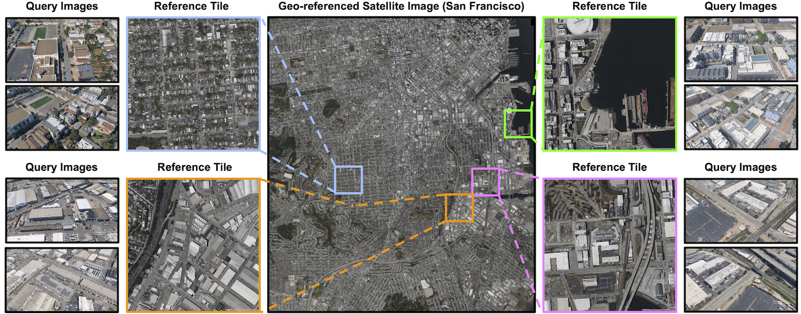

# SkyReg Dataset

## Description

SkyReg is a large-scale drone–satellite geo-registration dataset designed for dense, pixel-wise geodetic alignment. It consists of SkyReg-130k for training and SkyReg-Bench for evaluation, covering Urban, Landmarks, and Suburban scenes with diverse locations, camera configurations, viewpoint changes, and scene layouts. Each sample pairs a perspective drone image with a geodetically accurate satellite reference and includes dense annotations such as per-pixel latitude–longitude coordinates, metric depth, camera intrinsics, and 6-DoF camera poses. Urban scenes use orthorectified satellite tiles with LiDAR-derived depth, while Landmark and Suburban scenes use perspective satellite/drone views with SfM-derived depth.

## Dataset Structure

The dataset contains three main subsets:

- SkyReg-Urban/: Urban scenes from Chicago, San Francisco, and Seattle.
- SkyReg-Landmark/: Landmark scenes with drone and satellite images.
- SkyReg-Suburban/: Suburban scenes with drone and satellite images.

For the Landmark and Suburban subsets:

- GT_Images/ or GT_Image/: drone query images.
- GT_NPZ/: drone annotations.
- GT_Sat_Images/: satellite reference images.
- GT_Sat_NPZ/: satellite annotations.

The .npz files contain the metadata needed for geo-registration, including GPS coordinates, depth, and camera parameters. Demo contains code to derive the per pixel GPS from the .npz files.  More detail is shown in the README in the demo subdirectory.  

## Download Instructions

The SkyReg dataset is hosted on crcv.ucf.edu and can be accessed through the link below.  Due to the dataset size, we recommend using a stable internet connection and ensuring that sufficient local storage is available before downloading.

Dataset URL: https://www.crcv.ucf.edu/data1/SkyReg/

